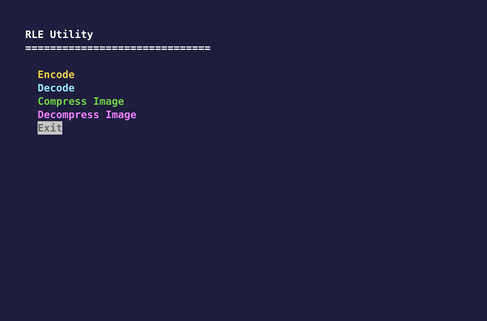

# RLE Utility

Minimal C project for application on Run-Length Encoding (RLE) algorithm.

## Features

- Text encode and decode
- BMP image compression to .rle(custom file extension)
- Terminal UI with ncurses

## Screenshot

Add a screenshot of the project here:

## License

this project is under MIT License.

## Reference

- stb library for image handling [https://github.com/nothings/stb]
